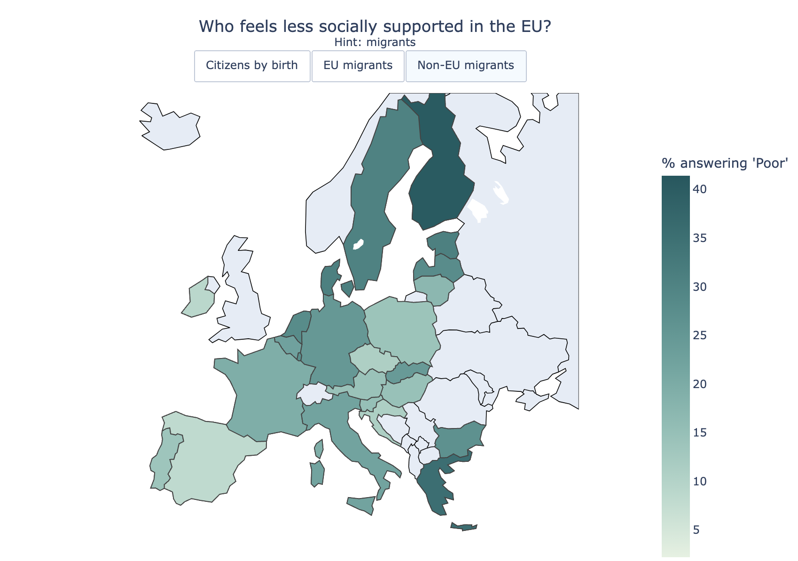

# Who in the EU feels having less social support?

## Overview

This project visualizes differences in the share of respondents reporting “Poor” social support across EU countries using interactive choropleth maps in Plotly.

The visualization:

- compares three datasets interactively,
- uses a shared color scale for meaningful comparison,
- displays additional indicators (Strong, Intermediate) on hover,
- focuses exclusively on EU countries,
- includes custom styling and annotations for presentation-quality output.

## Some conclusions

The strong feeling of social support isn't a given even among Europians who are citizens by birth. 


However, when it comes to perception of social support of non-EU migrants, they report a poor support more often - the common trend for all EU countries. In Finland, 40% of the non-EU respondents rate social support as "poor", the highest level in the EU, followed by Greece with 35%. 




## Notebooks

- **perception_analysis.ipynb** — exploratory notebook: data loading, cleaning, and initial wrangling across the three datasets.
- **perception_viz.ipynb** — final visualization: interactive choropleth map with toggle buttons, shared color scale, and hover details.

## Technologies
* Python
* Pandas
* Plotly (`plotly.graph_objects`, `plotly.express`)
* NumPy
* openpyxl (Excel file reading)

## Data
Source: Eurostat 2019, 'Overall perceived social support by sex, age and country of birth'.

## Setup

uv sync
```

To launch Jupyter via uv: 

uv run jupyter notebook
```
## Structure
```
project_perception/
├── data/
│   ├── citizens_by_birth.xlsx
│   ├── eu_migrants_2019.xlsx
│   └── non_eu_countries_2019.xlsx
├── perception_analysis.ipynb
├── perception_viz.ipynb
├── .gitignore
├── pyproject.toml
└── README.md
```